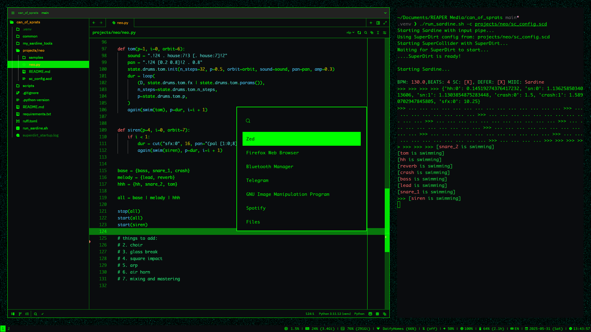

# 🌐 Matrix-Inspired Sway Configuration

A minimal Sway window manager configuration with Matrix-inspired aesthetics, dynamic wallpapers, and intelligent system monitoring with notifications.



## ✨ Features

### 🚀 Core Applications
- **Wofi** launcher (`Mod+D`) with Matrix styling
- **Window search** with fuzzy matching (`Mod+Shift+W`)
- **File finder** by recency (`Mod+Shift+F`)
- **Power menu** (`Mod+Shift+Q`) - lock, logout, suspend, reboot, shutdown

### 🎨 Visual Theme
- **Color Scheme**: Black (`#0a0c0e`), Matrix Green (`#00ff00`), Red alerts (`#ff6b6b`)
- **Dynamic glitch wallpapers** - auto-generated on login with teal/green noise patterns
- **Consistent theming** across all applications

### 📊 Smart Status Bar
Real-time monitoring with **intelligent notifications**:
- 🖥️ **CPU usage** - alerts at 90%+
- 🧠 **Memory usage** - percentage + absolute values, alerts at 90%+
- 💾 **Disk usage** - alerts at 90%+
- 📶 **Network** - WiFi signal + disconnection alerts
- 🔋 **Battery** - low (15%) and critical (5%) alerts
- 🔊 **Volume**, ☀️ **Brightness**, 🔵 **Bluetooth**, ⌨️ **Layout**, 📅 **Time**
- 🪟 **Window title** display

### 🔔 Notification System
- **Smart cooldown** (5-min intervals) prevents spam
- **Mako integration** with Matrix theming
- **State persistence** across sessions

### 🚀 Dynamic Workspace Navigation
- **Smart workspace switching** - automatically creates new workspaces as needed
- **Seamless navigation** with `Mod+=/−` for next/previous workspace
- **Gesture support** - swipe left/right to navigate workspaces
- **Container movement** with `Mod+Shift+=/−` - move windows and follow to adjacent workspaces
- **Boundary protection** - prevents going below workspace 0 (special floating workspace)

### 🤲 Gesture Support
- Swipe left/right: Dynamic workspace switching
- Swipe up: Window search
- Swipe down: App launcher

## ⌨️ Key Bindings

### Core
- `Mod+Q` - Kill window
- `Mod-Shift-D` - Run command
- `Mod+Shift+W` - Window search
- `Mod+Shift+F` - File finder
- `Mod+Shift+Q` - Power menu

### Layout
- `Mod+E` - Toggle tabbed/split layout
- `Mod+W` - Focus child container
- `Mod+U` - Toggle floating workspace

### Gaps
- `Mod+G` - Increase inner gaps on current workspace
- `Mod+Shift-G` - Decrease inner gaps on current workspace
- `Mod+X` - Increase outer gaps on current workspace
- `Mod+Shift-X` - Decrease outer gaps on current workspace
- `Mod+Ctrl-G` - Remove gaps on current workspace
 

### Notifications
- `Mod+N` - Dismiss notification
- `Mod+Shift+N` - Dismiss all notifications

### Workspaces
- `Mod+1-0` - Switch to numbered workspace
- `Mod+Shift+1-0` - Move window + follow to numbered workspace
- `Mod+Ctrl+1-0` - Move window only to numbered workspace
- `Mod+=/−` - Dynamic next/previous workspace (creates new workspaces automatically)
- `Mod+Shift+=/−` - Move container + follow to adjacent workspace

## 🛠️ Installation

### Prerequisites
```bash
sudo pacman -S sway wofi alacritty mako grim jq networkmanager upower libnotify
sudo pacman -S python python-pip python-pillow python-numpy
```

### Setup
```bash
git clone <repo-url> ~/.config/sway-dotfiles
ln -sf ~/.config/sway-dotfiles/sway ~/.config/sway
ln -sf ~/.config/sway-dotfiles/wofi ~/.config/wofi
ln -sf ~/.config/sway-dotfiles/alacritty ~/.config/alacritty
ln -sf ~/.config/sway-dotfiles/mako ~/.config/mako

# Setup wallpaper generator
cd ~/.config/sway-dotfiles/noise_wp
python -m venv .venv
source .venv/bin/activate
pip install pillow numpy
```

## 🔧 Customization

### Alert Thresholds
Edit `sway/scripts/status_bar_info.sh`:
```bash
CPU_CRITICAL=90
MEMORY_CRITICAL=90
DISK_CRITICAL=90
BATTERY_LOW=15
BATTERY_CRITICAL=5
NOTIFICATION_COOLDOWN=300
```

### Colors
Edit `sway/config`:
```bash
set $black  #0a0c0e
set $white  #00ff00  # Matrix green
set $red    #ff6b6b   # Alerts
```

### Wallpaper
Unique glitch wallpapers are automatically generated on every login.

## 📁 Configuration Files

- `sway/config` - Main configuration with Matrix colors
- `sway/scripts/status_bar_info.sh` - Status bar with notifications
- `sway/scripts/dynamic-workspace.sh` - Smart workspace navigation logic
- `wofi/style.css` - Launcher styling
- `alacritty/alacritty.toml` - Terminal configuration
- `mako/config` - Notification styling
- `noise_wp/glitchy_wp.py` - Wallpaper generator

---

*"There is no spoon... only perfect window management."* 🥄✨
