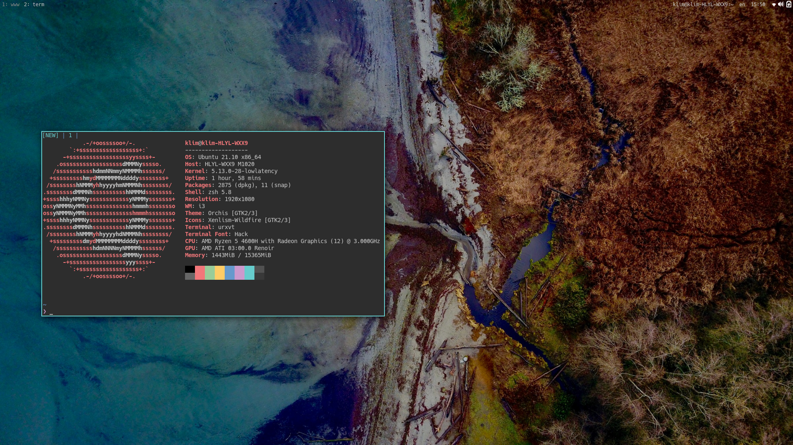

# My i3 setup
### Features
- show/hide i3bar
- fullscreen rofi with shadow and blur
- rofi includes file finder
- logout menu using rofi
- shift+enter to open floating terminal
- floating workspace (10)
- capslock switches escape
- configured media buttons
- nice colors, shadows, transitions
- pretty dunst notifications
- usable vim config

### Appearance

**GTK-Theme:** Orchis dark compact  
**Icons:** Xenlism Wildfire Monday  
**Font:** Hack  
**Colorscheme:** Tomorrow Night Eighties

### Dependencies
`i3-gaps picom rofi amixer light i3blocks i3-ipc oh-my-zsh urxvt slock`

### Some screenshots

