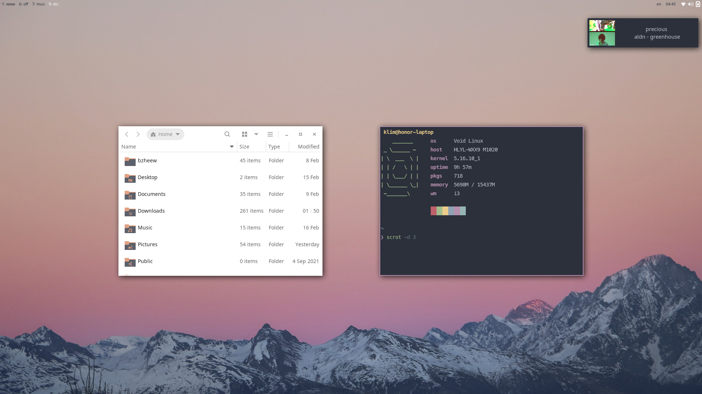
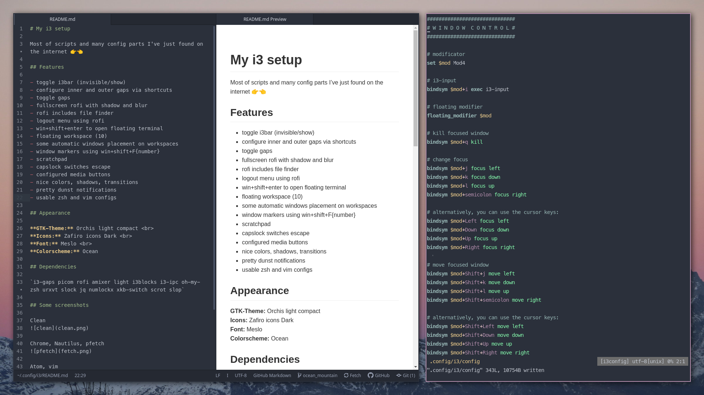
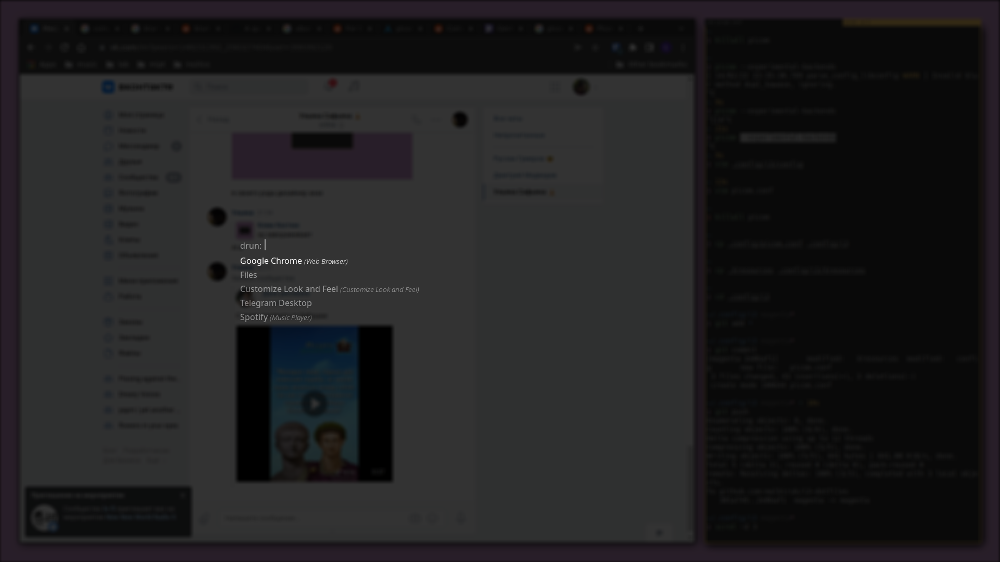

# My i3 setup

Most of scripts and many config parts I've just found on the internet 👉👈

## Features

- show/hide i3bar
- configure inner and outer gaps via shortcuts
- toggle gaps
- fullscreen rofi with shadow and blur
- rofi includes file finder
- logout menu using rofi
- win+shift+enter to open floating terminal
- floating workspace (10)
- some automatic windows placement on workspaces
- window markers using win+shift+F{number}
- capslock switches escape
- configured media buttons
- nice colors, shadows, transitions
- pretty dunst notifications
- usable zsh and vim configs

## Appearance

**GTK-Theme:** Orchis dark compact  
**Icons:** Xenlism Wildfire Monday  
**Font:** Hack  
**Colorscheme:** Tomorrow Night Eighties

## Dependencies

`i3-gaps picom rofi amixer light i3blocks i3-ipc oh-my-zsh urxvt slock jq`

## Some screenshots

Floating workspace showing i3bar and notification

Chrome, Nautilus, pfetch

Atom, vim

rofi

#cb99cc

